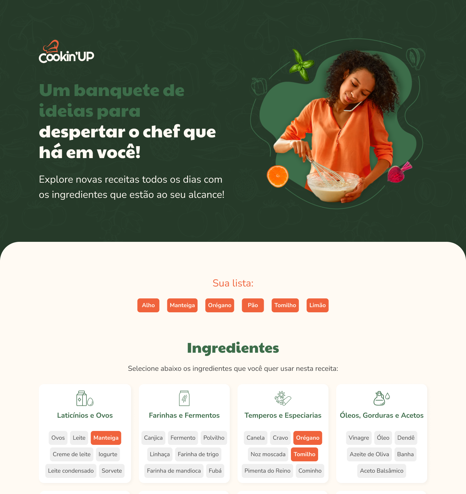

<h1 align="center"> Cookin Up Vue </h1>

<p align="center">
  Projeto prático de Vue.js feito na trilha de formação Vue.js 3 da Alura!
</p>

<br>

<p align="center">
  
</p>
<br /><br />

## 🚀 Tecnologias

Esse projeto foi desenvolvido com as seguintes tecnologias:

- [Vue.js 3](https://vuejs.org/)
- [TypeScript](https://www.typescriptlang.org/)

## 💻 Projeto

O projeto simula um site onde é possível pesquisar receitas com base em tags pré-selecionadas.

<h1 align="center"> Setup Front-end</h1>

## 🔥 Front-end

Instale as dependências do projeto:

```
npm install
```

Rode a aplicação:

```
npm run dev
```

ou

```
npm run build
```

<br />

## 💻 Formação Vue.js Alura

- [Acesse o curso clicando aqui](https://www.alura.com.br/formacao-vuejs3)
  <br /><br />

## 🚀 Certificado

<p align="center">
  
</p>

<h4 align="center">
 
  <br />
  Feito com ♥ no Ubuntu 22.04 LTS
</h1>